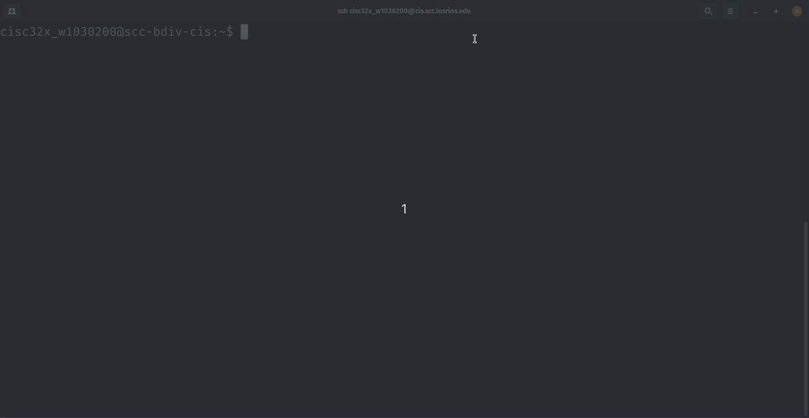

# CISC323 - Lab 1 Assignment

**Ryan Uselmann** 
**w1030200** 
**CISC 323**

## Hands On Project 1-3

------

## Hands On Project 1-5

**What information appears after entering who am i?**

The current logged in user along with time and ip address.

------

## Hands On Project 1-7

**What is the purpose of the -M option?**

To specify an alternate manpath to use. This option overrides the manpath derived code path for search and causes option -m to be ignored.

------

## Hands On Project 1-11

Did this before trying the gifs and I didn’t really want to reset my password again.

------

## Hands on Project 1-15

------

## Hands on Project 1-17

------
