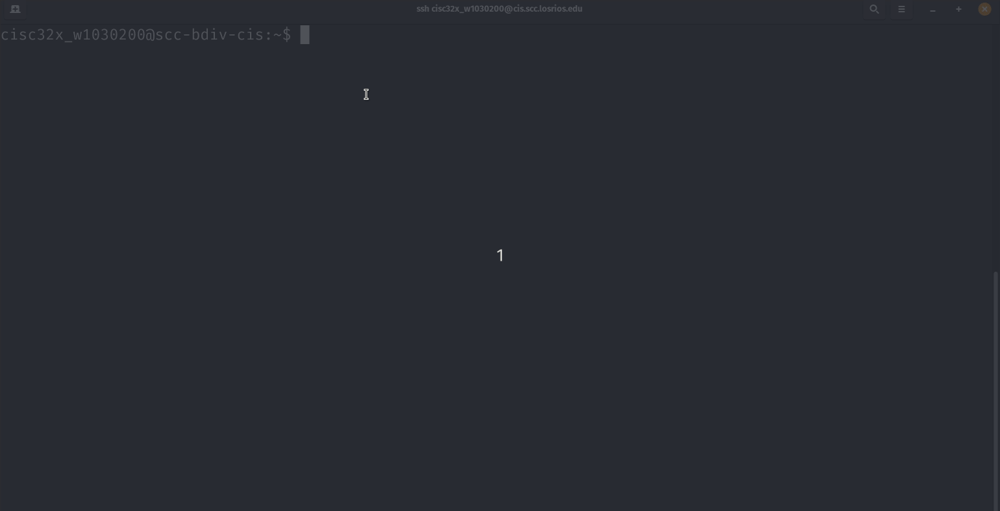
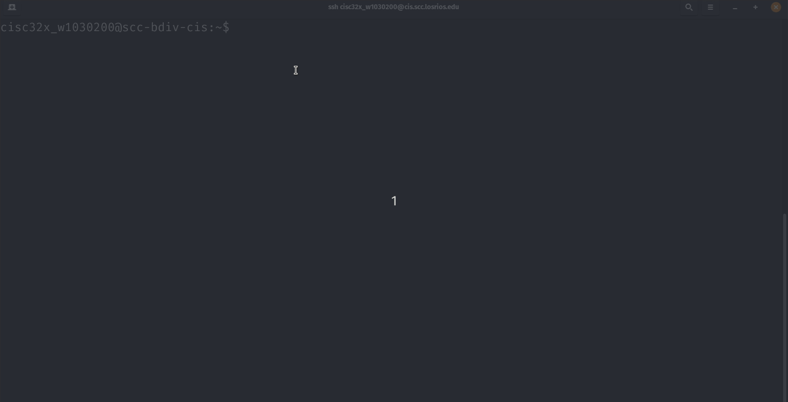
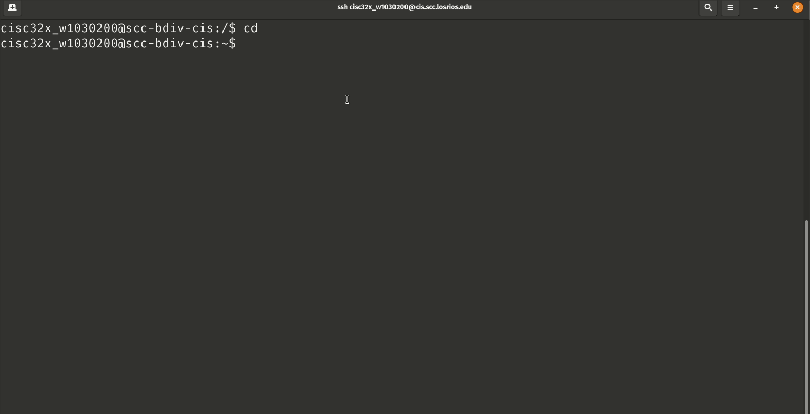
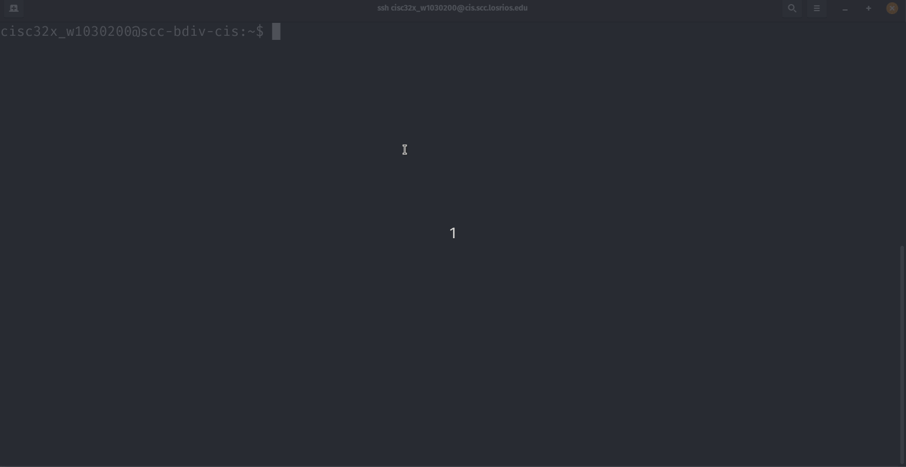
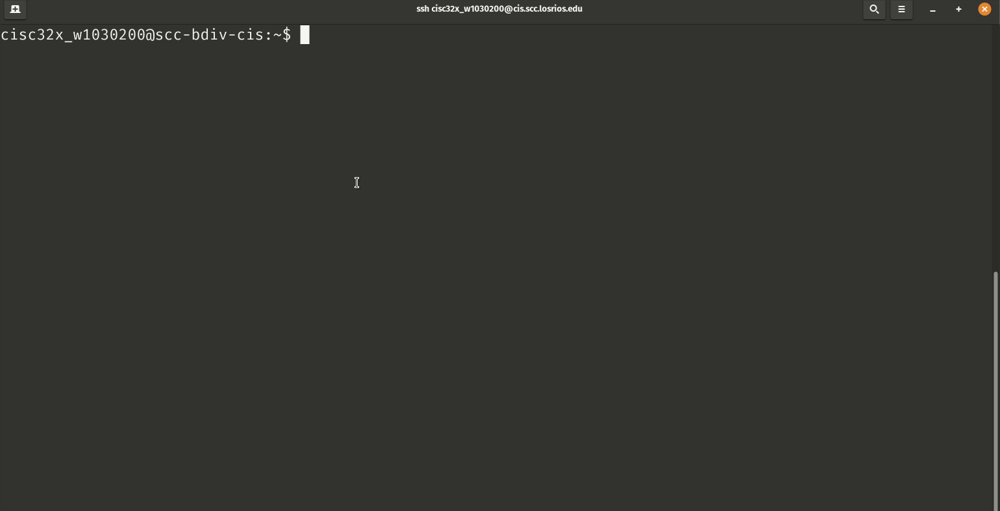

# CISC323 - Lab 2 Assignment

**Ryan Uselmann** 
**w1030200** 
**CISC 323**

## Hands On Project 2-3

**How does your prompt change from what you saw in Step 5?**

It goes back to the default. What I understand about settings for bash is to make the change permanent you have to edit the ~/.bashrc profile.

------

## Hands On Project 2-5

------

## Hands On Project 2-7

------

## Hands On Project 2-9

------

## Hands on Project 2-11

------
