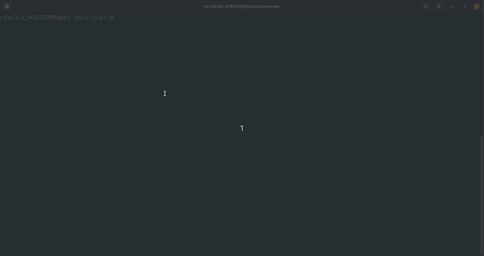
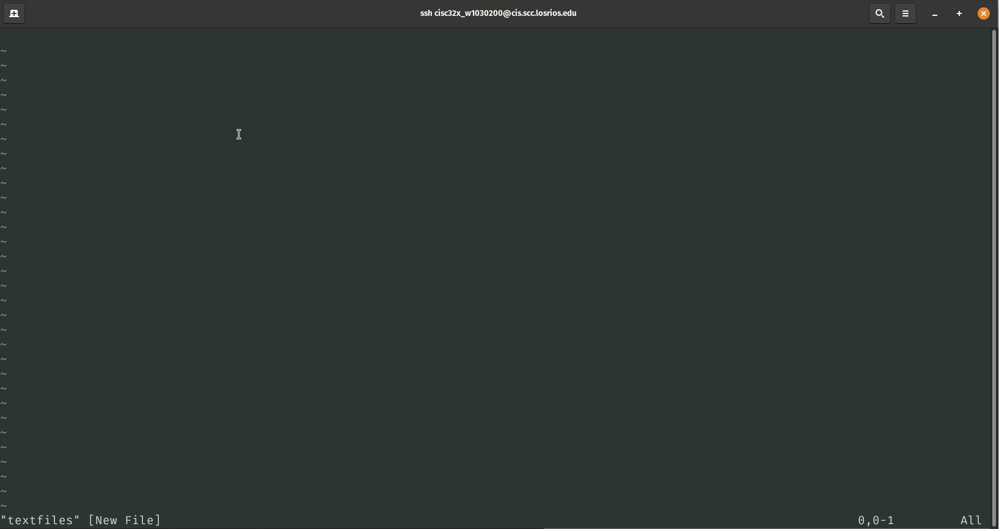
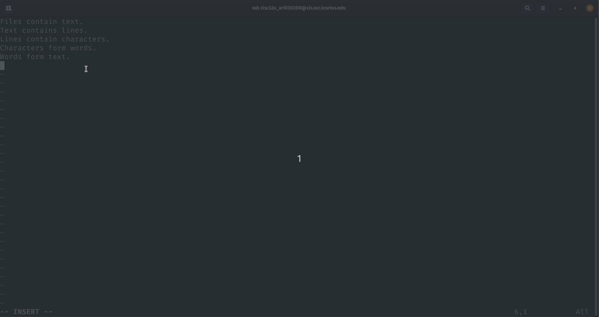
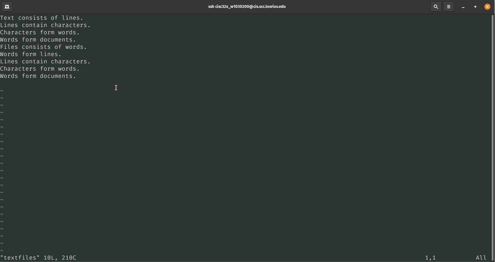
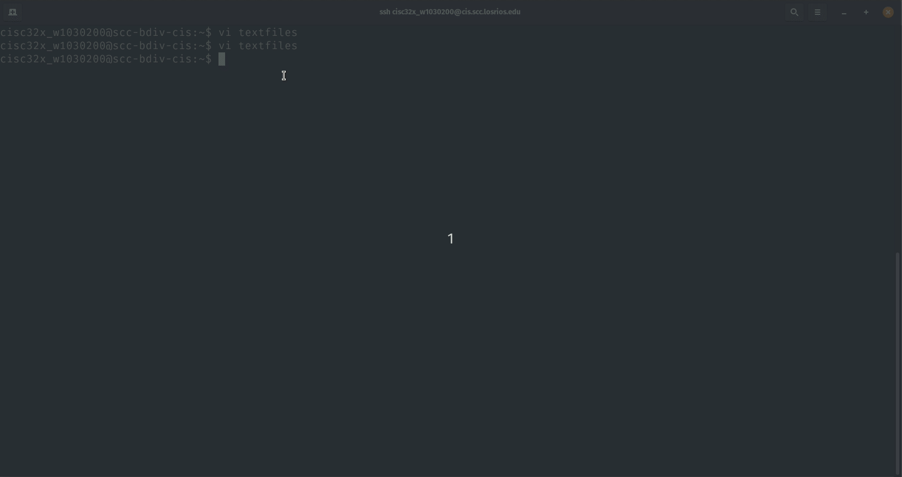

# CISC323 - Lab 3 Assignment

**Ryan Uselmann** 
**w1030200** 
**CISC 323**

## Hands On Project 3-1

------

## Hands On Project 3-2

**What happens to the line at the bottom of the screen?**

The line at the bottom goes away. Only -- INSERT -- is used to denote insert mode, whereas I do not see a visual indicator for command mode.

------

## Hands On Project 3-3

------

## Hands On Project 3-8

------

## Hands on Project 3-9

------