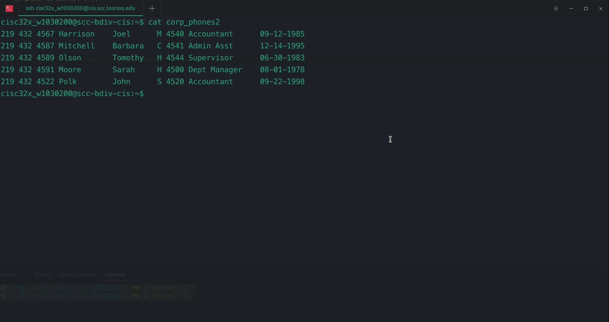
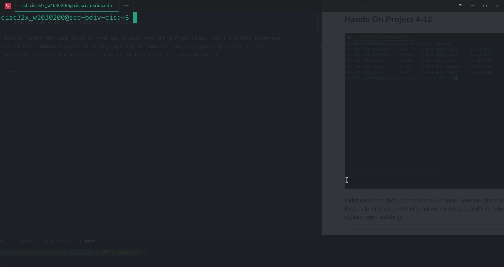
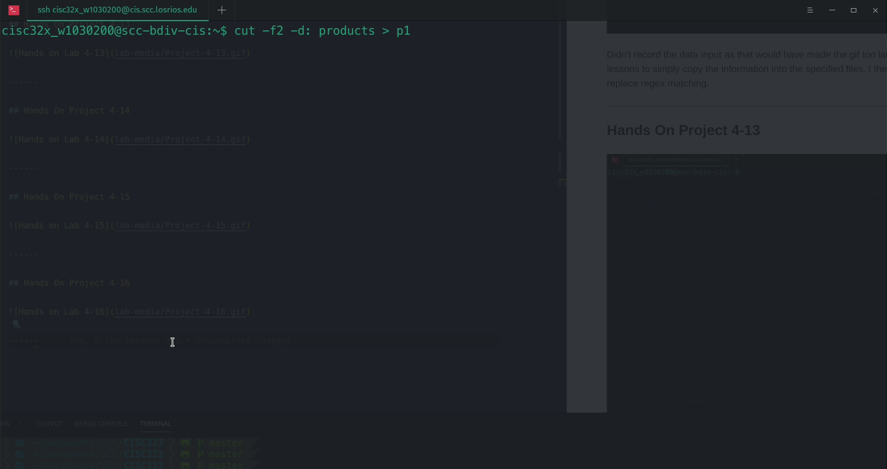
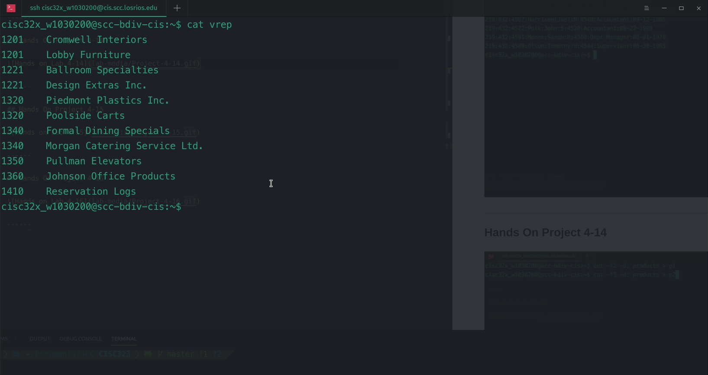
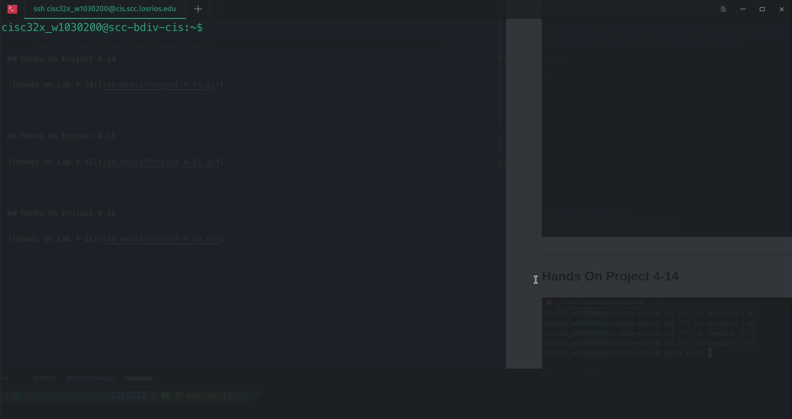

# CISC323 - Lab 4 Assignment

**Ryan Uselmann** 
**w1030200** 
**CISC 323**

## Hands On Project 4-12

Didn't record the data input as that would have made the gif too large, but I did take advantage of earlier command lessons to simply copy the information into the specified files. I then modified the files to specification by using find & replace regex matching.

------

## Hands On Project 4-13

------

## Hands On Project 4-14

------

## Hands On Project 4-15

------

## Hands On Project 4-16

------